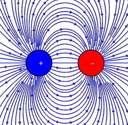
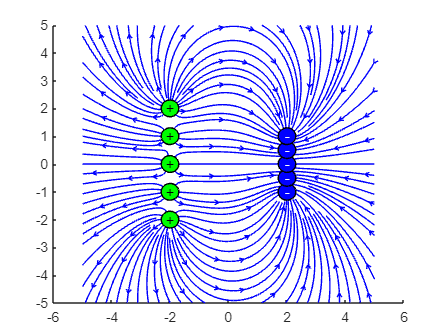
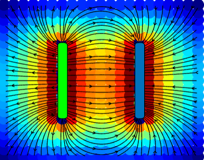

# Malaria_Diagnosis

Malaria, caused by a parasite transmitted by infected mosquitoes, is a severe disease affecting millions globally, especially in low-income countries. It results in hundreds of thousands of annual deaths, predominantly in African children, making it the parasitic disease with the highest morbidity and mortality. The economic burden on affected countries poses a threat to their growth. Despite preventive measures and diagnostic methods like serology, blood microscopy, and PCR, resource limitations hinder combating and diagnosing the disease. Hence, international collaboration is crucial for malaria prevention and treatment.

  

In this context, this computational simulation is created to visualize and calculate the non-uniform electric field produced by two parallel plate electrodes with opposite charges, similar to those used in dielectrophoresis for malaria diagnosis. This simulation aims to facilitate the study and understanding of non-uniform electric fields in dielectrophoresis. By gaining a better understanding of how parasites behave in electric fields, we can develop new strategies to combat the disease and improve the health of at-risk individuals.

Dielectrophoresis is a technique for distinguishing different charges with varying properties. This is achieved by applying an electric field and observing the movement of charges.

  
  

